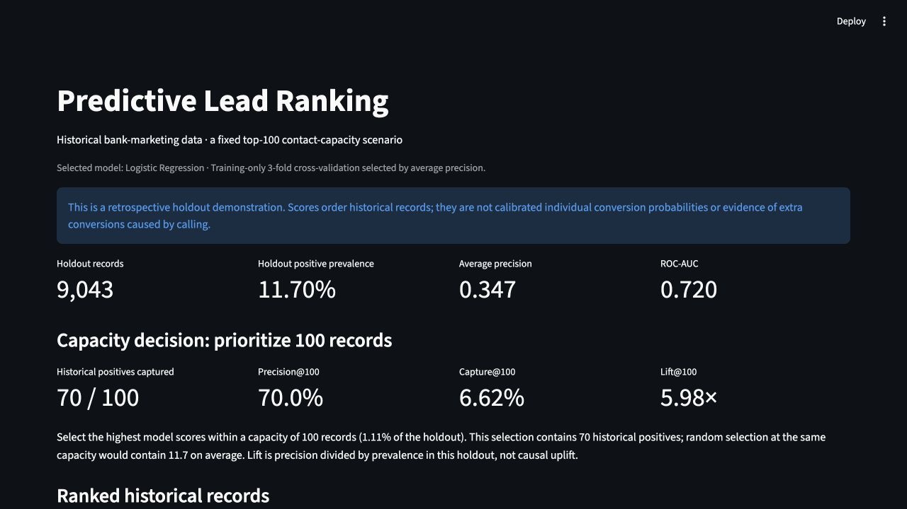

# Predictive Lead Ranking

A predictive lead-ranking and decision-support portfolio project using historical bank-marketing data.
**Question:** which 100 records would a model prioritize when contact capacity is limited?

**Result:** training cross-validation selected **Logistic Regression**. Its top 100 holdout records
contain **70 historical subscriptions**, compared with **11.7 expected under random selection**.
This is retrospective ranking evidence, not a claim that calling causes extra conversions.

Historical data → training-only preprocessing → three-model comparison → selected ranking model → top 100 → Streamlit demo.

## Data and decision point

The [UCI Bank Marketing dataset](https://archive.ics.uci.edu/dataset/222/bank+marketing),
older `bank-full.csv` variant, contains 45,211 records and 5,289 subscriptions (11.70%).
A lead is a historical record, not a verified unique customer. Target `y` indicates term-deposit subscription.
The raw file was verified against the official download and left unchanged.
[Data definitions, attribution and license](data/README.md).

The scenario is **pre-contact prioritization in the current campaign**, using client attributes
assumed to be available beforehand and documented prior-campaign history.

- **Included:** age, balance, previous, job, marital, education, default, housing, loan, poutcome.
- **Excluded:** duration, contact, day, month, campaign and pdays. Current-contact information is
  unsuitable for this scenario; the reference time of the pdays interval is insufficiently established.
- Unknown categories are retained. No nulls or duplicate complete rows were found; numeric extremes
  are inspected and retained. Profile snapshot timing remains an explicit assumption.

## Methodology and model selection

An 80/20 stratified split with seed 42 reserves 9,043 records for final evaluation.
On the 36,168 training records, three-fold stratified cross-validation compares the existing
Logistic Regression, balanced Logistic Regression and 100-tree Random Forest models.
A scikit-learn Pipeline/ColumnTransformer fits scaling and one-hot encoding inside each training fold.
No hyperparameter search is used; Logistic Regression converges without warnings.

The highest mean validation **average precision** selects the model. ROC-AUC is secondary;
exact AP ties use model name order. The holdout is not used to select the model, features or thresholds.

| Candidate | Mean CV average precision | Mean CV ROC-AUC |
|---|---:|---:|
| Logistic Regression | 0.3447 | 0.7111 |
| Balanced Logistic Regression | 0.3425 | 0.7117 |
| Random Forest | 0.2904 | 0.6757 |

The selected pipeline is refitted on all training records. Only that model is evaluated on the holdout.
AP is average precision, not trapezoidal PR-AUC. The small LR/balanced-LR difference does not establish
universal superiority; the selection follows the stated rule.

## Final holdout results

All figures below come from [model_evaluation.json](data/model_evaluation.json), generated by the
[executed notebook](notebooks/01_eda.ipynb).

| Metric | Result |
|---|---:|
| Holdout records | 9,043 |
| Positive outcomes | 1,058 |
| Positive prevalence | 11.70% |
| Average precision | 0.3472 |
| ROC-AUC | 0.7204 |
| Accuracy, default classification threshold | 89.34% |
| Majority-class accuracy baseline | 88.30% |

Accuracy is secondary: the improvement over always predicting the majority class is only
1.04 percentage points. The JSON also reports positive-class
precision, recall and F1. Ranking is the central use case; model outputs are **uncalibrated model scores**,
not validated individual conversion probabilities.

## Fixed capacity: top 100

Select the 100 highest scores (1.11% of the holdout), breaking ties by ascending source row ID.
The capacity was fixed before model selection and evaluation.

| Metric | Definition | Result |
|---|---|---:|
| Positives captured@100 | Observed positives in selected records | 70 |
| Precision@100 | Selected positives / 100 | 70.0% |
| Capture@100 | Selected positives / all 1,058 holdout positives | 6.62% |
| Lift@100 | Precision@100 / prevalence in this holdout | 5.98× |

Lift measures concentration of historical positives, **not causal uplift**. The random reference is an
expected count, not an observed experiment. This prioritization could support a capacity decision;
reduced costs, additional sales and ROI have not been measured.

## Streamlit decision-support demo

The app reads generated evaluation data and exactly 100 ranked records. It names the selected model,
shows the same holdout/capacity metrics, and provides a scrollable historical results table.
`Top 100` is a capacity label. `source_row_id` identifies a source row; `actual_outcome` is known only
afterward and is displayed solely for evaluation. The app does not perform live scoring.



## How to reproduce

Tested on **Python 3.14.4** on macOS. Exact tested direct dependency versions are in
[requirements.txt](requirements.txt); these were tested in the available local Python environment,
not independently reinstalled into a fresh environment during this repair.

From the repository root, create a fresh environment rather than relying on an older local `.venv`:

```bash
python3.14 -m venv .venv
source .venv/bin/activate
python -m pip install -r requirements.txt
python -m jupyter nbconvert --to notebook --execute notebooks/01_eda.ipynb --inplace --ExecutePreprocessor.kernel_name=python3 --ExecutePreprocessor.timeout=240
python -m unittest discover -s tests -v
python -m streamlit run app/app.py
```

Alternatively open the notebook with `python -m jupyter notebook`, select the environment's Python
kernel and run all cells. Execution regenerates `data/top_leads.csv` and `data/model_evaluation.json`.
Use the notebook from the repository root or its notebooks directory; data paths locate the project root.
The app resolves paths from its own file location.

The full notebook was executed twice; the two generated data files were byte-identical. The final run
includes the PR/ROC and capacity plots. Four tests check holdout membership and outcomes, artifact/metric
consistency, complete warning-free notebook outputs, and the Streamlit metrics/table. The app was also
inspected in a browser and the screenshot captured from that running app.
Small numerical differences remain possible on other Python/library/platform versions.

## Limitations

- Historical random-split evidence, not prospective or temporal validation. Prior project/audit work
  inspected the original holdout; this revised selection procedure does not turn it into an unseen
  external dataset. No further candidate was chosen using these final test results.
- Profile timestamps and unique customer IDs are absent. Pre-contact availability is an assumption
  for included client attributes. 375 holdout records share an included-feature profile with training
  records; this neither proves nor rules out customer overlap.
- No calibration, causal effect, fairness, budget optimization or production-readiness claim.
- Demographic and financial attributes may encode disparities. A real application would require
  prospective validation and assessment of its intended use.
- A fixed top 100, three CV folds and a single holdout support a compact demonstration, not a claim
  of a universally optimal sales strategy.

## Repository contents

```text
app/app.py                    Streamlit artifact viewer
notebooks/01_eda.ipynb         Executed analytical walkthrough and artifact generation
data/bank-full.csv            Unchanged source data
data/top_leads.csv            Generated top 100
data/model_evaluation.json    Generated metrics, selection and provenance
data/README.md                Data dictionary, exclusions and attribution
screenshots/dashboard.png    Current app overview
tests/test_artifacts.py       Four artifact and app checks
requirements.txt             Tested direct dependency versions
```

## Portfolio provenance

Portfolio owner: **Oliver de Bruin**. This case demonstrates tabular analysis, training-only preprocessing,
model comparison, ranking evaluation and a Streamlit decision-support presentation.
OpenAI Codex assisted with this portfolio repair, documentation and verification. This statement does
not claim how the original project was authored. The existing repository name is retained; the UI and
project description use “Predictive Lead Ranking” because no autonomous agent is implemented.
